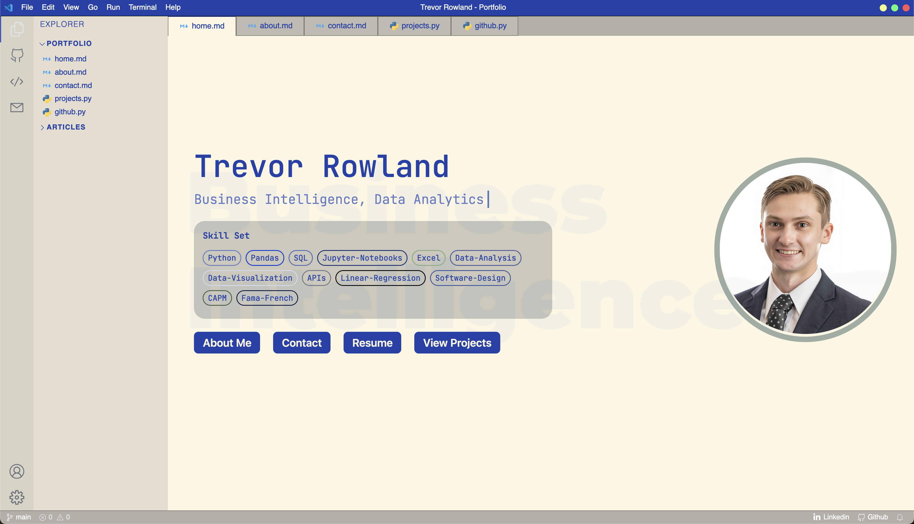

# VScode Portfolio

A Visual Studio Code themed developer portfolio website built with Next.js and deployed on Vercel.



Huge shoutouts to the [original project](https://github.com/drkostas/drkostas.github.io) by [drkostas](https://github.com/drkostas)! This is an amazing portfolio project and I am very thankful for his creation of the original project.

### Changelog:

#### 3/5/24

+ Tags on the Homepage are now clickable elements that lead to a filtered list of Projects and Articles that filter based on the tag clicked
+ Projects and Articles Pages now have a "Filter Tags" Button that lets the user filter by a specified tag, filtering by multiple tags will be added later but for now, there is a lot of redundancy in the tags
+ Articles are Converted Jupyter Notebooks, rendered with `react-markdown`, `remark-math`, `rehype-katex` and `highlight.js`. This still has some formatting issues, but for now it works well enough to deploy and start getting feedback.
+ Current To-Dos are to fix the formatting on Article Pages, and Fix the Article Cards having dynamic length, it doesn't look great.
+ Other To-Dos include more edits to the code blocks on articles and copy buttons for the code blocks, but this will likely need to be done in the summer.

#### 2/23/24

+ Removed Extra Themes and reformatted the Settings Page to improve aesthetics
+ Cleaned up the CSS for light and dark themes to improve readability
+ Removed Articles and HTML, going to be attacking this with markdown articles and MDX instead
+ Refactored the Public folder to reduce a little clutter
+ Added Border Radiuses to Project Images to improve aesthetics
+ Changed Sizes of Homepage components for improved readability
+ Added Projects and Resume Download Button

#### 2/16/24

+ added 2 new themes, Solar-ish Light and Solar-ish Dark. These are themes similar to the Solarized Light and a Dark version of the theme to fit the vibes I am going for with my portfolio.
+ added some custom tags in Index.jsx to better describe my skills
+ added an Articles section to the "Explorer" Tab, with functionality to post some kind of article/jupyter notebook coming soon
+ removed extraneous stuff from drkostas's original project to keep the size of this smaller and learn what can/can't be removed from the project. This is still a work in progress and I plan to only have my own work on top of the original skeleton at some point to truly transform the project instead of just ripping it off and slapping my name on there

## Original README

## Environment Variables

For fetching your articles from dev.to, create an `.env.local` file inside the project directory. Check the `.env.local.example` file for more information.

## Running Development Server

```bash
npm run dev
# or
yarn dev
```

Open [http://localhost:3000](http://localhost:3000) with your browser to see the result.

All VSCode related components can be found in the `components` folder. To change the content of the portfolio, check out the `pages` folder. To add or remove pages, modify `components/Sidebar.jsx` and `components/Tabsbar.jsx`.

## Next.js Resources

To learn more about Next.js, take a look at the following resources:

- [Next.js Documentation](https://nextjs.org/docs) - learn about Next.js features and API.
- [Learn Next.js](https://nextjs.org/learn) - an interactive Next.js tutorial.

You can check out [the Next.js GitHub repository](https://github.com/vercel/next.js/)

## Deploy on Vercel

The easiest way to deploy your Next.js app is to use the [Vercel Platform](https://vercel.com/new?utm_medium=default-template&filter=next.js&utm_source=create-next-app&utm_campaign=create-next-app-readme) from the creators of Next.js.

Check out our [Next.js deployment documentation](https://nextjs.org/docs/deployment) for more details.
