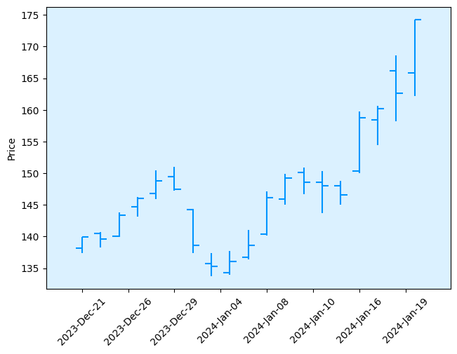
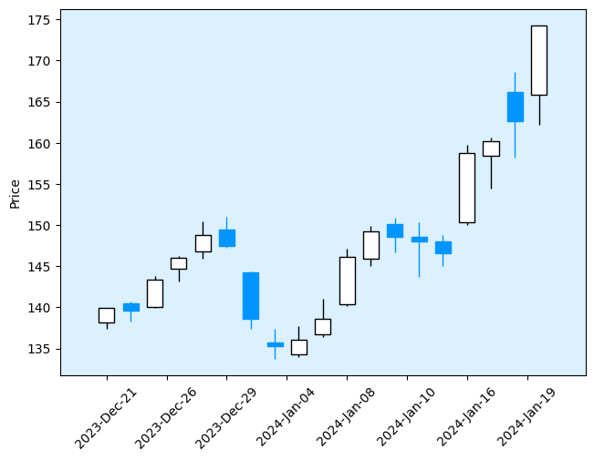
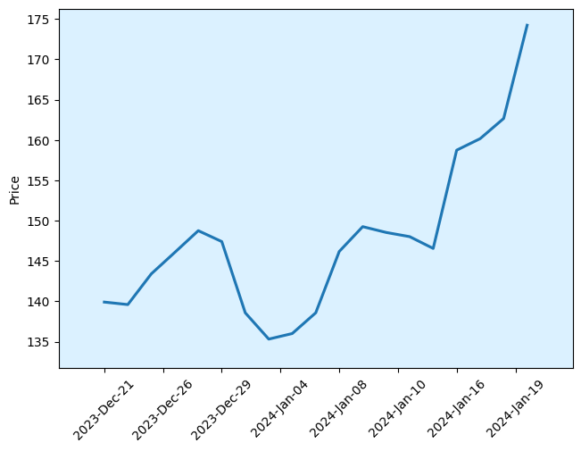
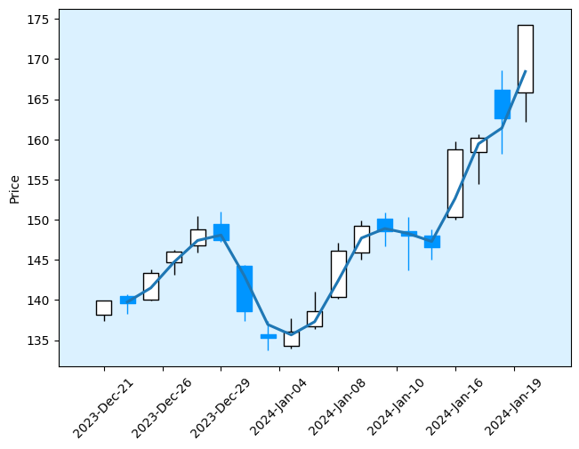
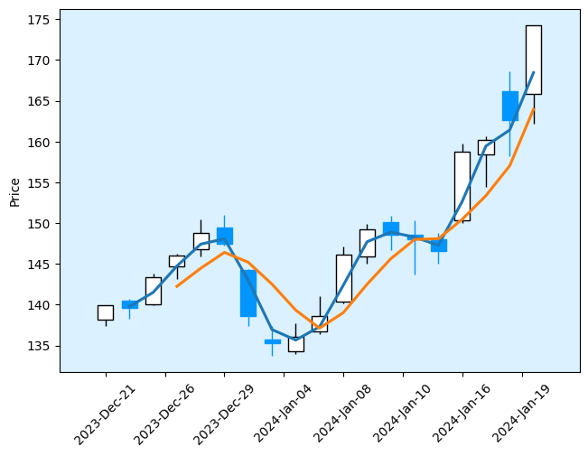
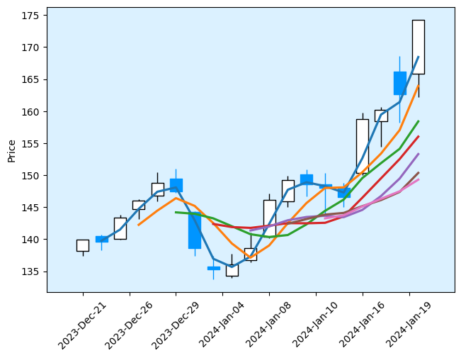
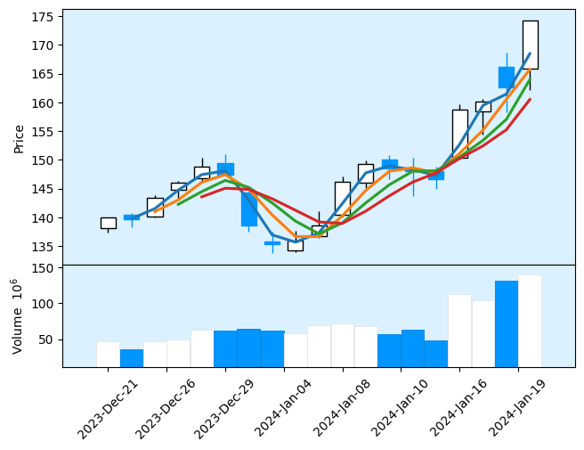
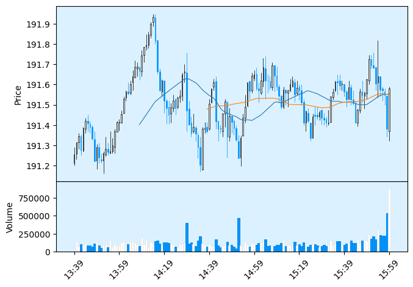

# Creating Visualizations for Candle Data in MPLFinance

MPLFinance is a library based on MatPlotLib that can create candle charts from financial datasets. This is useful to show how the stock moves over an interval in a more detailed way than a simple line chart.

This notebook will cover:

- Graphing Candle Data of a stock
- Graphing Candle Data with the volume
- Graphing Candle Data with custom moving averages


## Imports and Configs


```python
import pandas as pd
import mplfinance as mpf
import yfinance as yf
import datetime as dt
```


```python
stock = 'AMD'

end_dt = dt.datetime.today()
start_dt = end_dt - dt.timedelta(days=30)

mpf_s='blueskies' # Style for the mpf Graphs
```

## Collecting Stock Data


```python
# Create a Ticker Object to access Financial Statement Data
s = yf.Ticker(stock)

s_candles = yf.download(tickers=stock, start=start_dt, end=end_dt, interval='1d')
```

    [*********************100%%**********************]  1 of 1 completed


## Graphing the Data

### 30-Day OHLC Graph


```python
mpf.plot(s_candles, style=mpf_s)
```


    

    


### 30-Day Candles Graph


```python
mpf.plot(s_candles, type='candle', style=mpf_s)
```


    

    


### 30-Day Line Graph


```python
mpf.plot(s_candles, type='line', style=mpf_s)
```


    

    


### 30-Day Candles Graph with Moving Averages


```python
# Graph the Raw Candle Chart
print('Raw Candle Chart:')
mpf.plot(s_candles, type='candle', style=mpf_s)

# Graph the Candle Chart with a 2-Day Moving Average
print('2-Day Moving Average:')
mpf.plot(s_candles, type='candle', mav=(2), style=mpf_s)

# Graph the Candle Chart with a 2-Day and a 4-Day Moving Average
print('2-Day, 4-Day Moving Average:')
mpf.plot(s_candles, type='candle', mav=(2, 4), style=mpf_s)

# Graph the candle chart with a 2, 4, 6, 8, 10, 12, 14 day moving average
print('Candle Graph with the max amount of Moving Averages available(7):')
mpf.plot(s_candles, type='candle', mav=(2,4,6,8,10,12,14), style=mpf_s)
```

    Raw Candle Chart:


    

    


    2-Day Moving Average:


    

    


    2-Day, 4-Day Moving Average:


    

    


    Candle Graph with the max amount of Moving Averages available(7):


    

    


### 30-Day Candles Charts with Moving Averages and Volume


```python
mpf.plot(s_candles, type='candle', mav=(2,3,4,5),volume=True, style=mpf_s)
```


    

    


### Takeaway:

- MPLFinance is a very powerful tool with much cleaner and simpler graphs to implement than the traditional MatPlotLib library.
- The timeframe used in this example was daily candles, however you could also use intraday trading data with data collected by the minute, shown below
- Additional Features and Demos can be found on the Examples Section of the MPLFinance Repo: <https://github.com/matplotlib/mplfinance/tree/master/examples>


```python
daily_end_dt = dt.datetime.now()
daily_start_dt = daily_end_dt - dt.timedelta(days=1)

candles = yf.download(tickers='AAPL', start=daily_start_dt, end=daily_end_dt, interval='1m')

print('Intra-day Candle Chart with 30 and 60 minute Moving Averages and Volume Enabled;1 Candle = 1 Minute:')
mpf.plot(candles, type='candle', mav=(30,60), volume=True, style=mpf_s)
```

    [*********************100%%**********************]  1 of 1 completed

    Intra-day Candle Chart with 30 and 60 minute Moving Averages and Volume Enabled;1 Candle = 1 Minute:


    


    

    

