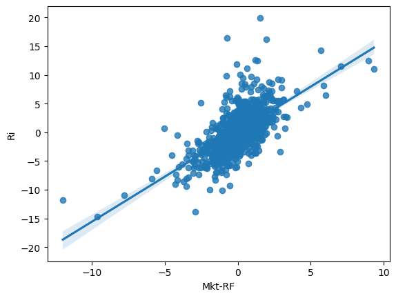

# Using Regression with CAPM

This code is for making a simple CAPM Regression Model using Dr. French's Historical Data and the TD Ameritrade API's Candle Data

It takes data from: 
- ~~TD Ameritrade and tda-api: https://developer.tdameritrade.com/ & https://tda-api.readthedocs.io/en/latest/~~ (Doesn't give Adj. Close Data)
- Yahoo Finance: https://finance.yahoo.com/ and the yfinance Package: https://readthedocs.org/projects/yfinance/
- Dr. Kenneth R. French's Data Library(for risk-free rates and market rates): https://mba.tuck.dartmouth.edu/pages/faculty/ken.french/data_library.html

#### For Next Time: You can directly connect to Dr. French's Database using the pandas datareader!

##### data = reader.DataReader(<filename>, 'famafrench', start, end)

This notebook also utilizes some prewritten functions to pull data without the big setups required for the tda-api, and can be found in the configs.py file in the functions subfolder

The Configs and CSV Data Files will be saved in the repository /Users/dB/.secret/ under the filename 'tda-api-v6.json' and pathname 'ff-research-data'. Their paths are listed here for easier access while I write in this notebook:

/Users/dB/.secret/tda-api-v6.json

/Users/dB/.secret/ff-research-data/

## Step 1: Import Necessary Packages and Add Configs


```python
# Imports -----------------------------------------------------------------------------
# from tda.client import Client
# from tda import auth as a
import yfinance as yf
import pandas as pd
import datetime as dt
import statsmodels.api as sm
```


```python
# Configs -----------------------------------------------------------------------------
# tda_api_json_path = '/Users/dB/.secret/tda-api-v6.json'
# tda_api_json = c.get_account_data(tda_api_json_path)

ff_data_path = '/Users/dB/.secret/ff-research-data/F-F_Research_Data_Factors.CSV'
ff_data_weekly_path = '/Users/dB/.secret/ff-research-data/F-F_Research_Data_Factors_weekly.CSV'
ff_data_daily_path = '/Users/dB/.secret/ff-research-data/F-F_Research_Data_Factors_daily.csv'

symbol = 'AMD'
end_dt = dt.datetime.now() # Today's Date
start_dt = end_dt - dt.timedelta(days = 1825) # Subtract 5 Years from Today
```

## Step 2: Collect Data and Process into DataFrames

To collect the data, we need to read Dr. French's CSVs for data and call the ~~TD Ameritrade~~ Yahoo Finance API for candle data.

Reading Dr. French's CSVs is a simple process, all we need to do is decide to use daily or weekly data and then call Panda's read_from_csv() function. We will need to translate the dates into datetime objects to match up with the API data, which we can quickly do with pandas.to_datetime(index, format=%Y%m%d)

Calling yfinance.download() will pull down candle data for a stock. This will provide us with the open, close, adjusted close, high, low and volume data for the specified timeframe. To get a larger dataset that we can join with Dr. French's dataset with pandas.concat(), we need to call download() with an interval of 1 day('1d')

~~I have a function from the dBI project named get_price_history_df() that can call the API once a Client object is created, and we can pass in '1d' and '1w' as the periods parameter for the daily and weekly data.~~


```python
# Function to read data from the CSV
def read_ff_csvs(path: str):
    try:
        df = pd.read_csv(path, skiprows=3, index_col=0) # Read CSV, skip the intro text in the csv
        df.drop(index=df.index[-1], axis=0, inplace=True) # drop the "Copyright" row at the bottom
        df.index = pd.to_datetime(df.index, format='%Y%m%d') # Format the date column(index) into a datetime object
        
    except FileNotFoundError as e:
        print(e)
    
    return df

daily_data = read_ff_csvs(ff_data_daily_path)

daily_data.index.name = 'datetime'

# Print the Data
print('Daily Data:')
print(daily_data.head())
```

    Daily Data:
                Mkt-RF   SMB   HML     RF
    datetime                             
    1926-07-01    0.10 -0.25 -0.27  0.009
    1926-07-02    0.45 -0.33 -0.06  0.009
    1926-07-06    0.17  0.30 -0.39  0.009
    1926-07-07    0.09 -0.58  0.02  0.009
    1926-07-08    0.21 -0.38  0.19  0.009


```python
# Call the API for candle data
candles_daily = yf.download(tickers=symbol, start=start_dt, end=end_dt, interval='1d')

# Printing Candles DataFrames:
print('Daily Candles: ')
print(candles_daily.head())
```

    [*********************100%%**********************]  1 of 1 completed

    Daily Candles: 
                     Open       High        Low  Close  Adj Close     Volume
    Date                                                                    
    2019-01-28  20.320000  21.010000  20.020000  20.18      20.18  135164100
    2019-01-29  20.260000  20.389999  19.049999  19.25      19.25  131202500
    2019-01-30  21.490000  23.129999  21.370001  23.09      23.09  211421200
    2019-01-31  23.020000  25.139999  22.830000  24.41      24.41  182575600
    2019-02-01  24.610001  24.840000  24.070000  24.51      24.51  105356200


    


# Step 3: Merge the DataFrames

This step involves performing an inner-join on the API Data and French's Data DataFrames using DataFrame.concat


```python
# Concatenate the DataFrames
daily_df = pd.concat([candles_daily, daily_data], axis=1)
daily_df = daily_df.dropna()

# Print the DataFrames
print('Daily DataFrame:')
print(daily_df)
```

    Daily DataFrame:
                      Open        High         Low       Close   Adj Close  \
    2019-01-28   20.320000   21.010000   20.020000   20.180000   20.180000   
    2019-01-29   20.260000   20.389999   19.049999   19.250000   19.250000   
    2019-01-30   21.490000   23.129999   21.370001   23.090000   23.090000   
    2019-01-31   23.020000   25.139999   22.830000   24.410000   24.410000   
    2019-02-01   24.610001   24.840000   24.070000   24.510000   24.510000   
    ...                ...         ...         ...         ...         ...   
    2023-11-24  122.029999  123.250000  121.540001  122.309998  122.309998   
    2023-11-27  122.070000  123.889999  121.769997  122.650002  122.650002   
    2023-11-28  121.980003  122.540001  120.790001  122.010002  122.010002   
    2023-11-29  123.980003  125.730003  123.480003  123.849998  123.849998   
    2023-11-30  123.610001  124.050003  119.650002  121.160004  121.160004   
    
                     Volume  Mkt-RF   SMB   HML     RF  
    2019-01-28  135164100.0   -0.80 -0.16  0.63  0.010  
    2019-01-29  131202500.0   -0.19 -0.01  0.17  0.010  
    2019-01-30  211421200.0    1.51 -0.15 -0.94  0.010  
    2019-01-31  182575600.0    0.92  0.12 -1.08  0.010  
    2019-02-01  105356200.0    0.14 -0.14  0.43  0.010  
    ...                 ...     ...   ...   ...    ...  
    2023-11-24   19001000.0    0.11  0.59  0.19  0.021  
    2023-11-27   32743000.0   -0.23 -0.11 -0.08  0.021  
    2023-11-28   32047100.0    0.06 -0.29  0.05  0.021  
    2023-11-29   37876300.0    0.01  0.44  0.69  0.021  
    2023-11-30   44494200.0    0.35 -0.45  0.01  0.021  
    
    [1221 rows x 10 columns]


Let's get rid of all the columns we don't need to keep the outputs cleaner


```python
ddf_ff_capm = daily_df.drop(['Open', 'High', 'Low', 'Close', 'Volume', 'SMB','HML'], axis=1) # ddf_f = Daily DataFrame Filtered For CAPM
print(ddf_ff_capm.head())
```

                Adj Close  Mkt-RF    RF
    2019-01-28      20.18   -0.80  0.01
    2019-01-29      19.25   -0.19  0.01
    2019-01-30      23.09    1.51  0.01
    2019-01-31      24.41    0.92  0.01
    2019-02-01      24.51    0.14  0.01


# Step 4: Format DataFrame for Regression

## CAPM Formula: Ri - rf = α + β * (Mkt - rf) + ε

- Ri : Market Return
- rf : Risk-Free Rate
- Mkt : Market Rate
- α : Alpha
- β : Asset-Specific Risk
- ε : Random Noise

French's Dataset provides us with the (Mkt - rf) and rf terms, so we just need to calculate Ri before using regression. 

## Calculating Daily Returns:


```python
df = ddf_ff_capm
df['Ri'] = df['Adj Close'].resample('1D').ffill().pct_change() # Calculates the Daily Percent Change from the Adjusted Close Price
df['Ri'] = df['Ri']*100
df2 = df.dropna()
print(df2.head())
capm_df = df2
```

                Adj Close  Mkt-RF    RF         Ri
    2019-01-29  19.250000   -0.19  0.01  -4.608525
    2019-01-30  23.090000    1.51  0.01  19.948053
    2019-01-31  24.410000    0.92  0.01   5.716759
    2019-02-01  24.510000    0.14  0.01   0.409670
    2019-02-04  24.129999    0.72  0.01  -1.550392


## Define the Variables:


```python
iv = capm_df['Mkt-RF'] # iv = independent variable
dv = capm_df['Ri']-capm_df['RF'] # dv = dependent variable
```

## Using Statsmodel.API to build the regression Model

Later I will be building different Models from scratch to better understand what is going on underneath the hood, but to finish this notebook I will be performing CAPM Regression using the same methods as Algovibes in his video on CAPM Regression in Python(https://www.youtube.com/watch?v=Y-BqM3WaX-I)

The Model we will be using is the Ordinary Least Squares Model


```python
# Adding an Intercept:
ic = sm.add_constant(iv)

# Build the Model:
model = sm.OLS(dv, ic)

# Fit the Model
results = model.fit()
results.summary()
```


<table class="simpletable">
<caption>OLS Regression Results</caption>
<tr>
  <th>Dep. Variable:</th>            <td>y</td>        <th>  R-squared:         </th> <td>   0.420</td> 
</tr>
<tr>
  <th>Model:</th>                   <td>OLS</td>       <th>  Adj. R-squared:    </th> <td>   0.419</td> 
</tr>
<tr>
  <th>Method:</th>             <td>Least Squares</td>  <th>  F-statistic:       </th> <td>   880.4</td> 
</tr>
<tr>
  <th>Date:</th>             <td>Thu, 25 Jan 2024</td> <th>  Prob (F-statistic):</th> <td>4.78e-146</td>
</tr>
<tr>
  <th>Time:</th>                 <td>13:03:26</td>     <th>  Log-Likelihood:    </th> <td> -2876.2</td> 
</tr>
<tr>
  <th>No. Observations:</th>      <td>  1220</td>      <th>  AIC:               </th> <td>   5756.</td> 
</tr>
<tr>
  <th>Df Residuals:</th>          <td>  1218</td>      <th>  BIC:               </th> <td>   5767.</td> 
</tr>
<tr>
  <th>Df Model:</th>              <td>     1</td>      <th>                     </th>     <td> </td>    
</tr>
<tr>
  <th>Covariance Type:</th>      <td>nonrobust</td>    <th>                     </th>     <td> </td>    
</tr>
</table>
<table class="simpletable">
<tr>
     <td></td>       <th>coef</th>     <th>std err</th>      <th>t</th>      <th>P>|t|</th>  <th>[0.025</th>    <th>0.975]</th>  
</tr>
<tr>
  <th>const</th>  <td>    0.1156</td> <td>    0.073</td> <td>    1.578</td> <td> 0.115</td> <td>   -0.028</td> <td>    0.259</td>
</tr>
<tr>
  <th>Mkt-RF</th> <td>    1.5675</td> <td>    0.053</td> <td>   29.671</td> <td> 0.000</td> <td>    1.464</td> <td>    1.671</td>
</tr>
</table>
<table class="simpletable">
<tr>
  <th>Omnibus:</th>       <td>329.073</td> <th>  Durbin-Watson:     </th> <td>   2.080</td>
</tr>
<tr>
  <th>Prob(Omnibus):</th> <td> 0.000</td>  <th>  Jarque-Bera (JB):  </th> <td>1855.808</td>
</tr>
<tr>
  <th>Skew:</th>          <td> 1.126</td>  <th>  Prob(JB):          </th> <td>    0.00</td>
</tr>
<tr>
  <th>Kurtosis:</th>      <td> 8.607</td>  <th>  Cond. No.          </th> <td>    1.39</td>
</tr>
</table><br/><br/>Notes:<br/>[1] Standard Errors assume that the covariance matrix of the errors is correctly specified.


This gives us the Values of α and β, which can be found in the 2nd table of the summary, under the 'coef' column. The value of α is the 'const' row, and the value of β is in the 'Mkt-RF' row.

But how do we know if the values are correct?
We can check the Yahoo Finance Page for the Stock(AMD) and compare the Betas.(https://finance.yahoo.com/quote/AMD/)

Lastly, we can plot the data with Seaborn like Algovibes did in his tutorial:


```python
import seaborn as sns
sns.regplot(x='Mkt-RF', y='Ri', data=capm_df)
```


    <Axes: xlabel='Mkt-RF', ylabel='Ri'>


    

    


## Next Steps: From Dr. Forjan's Lecture

- Graph...
    - Security Market Line(SML): X-Axis is Beta, Y-Axis is Expected Return(E(Ri))
        - Mark RF, E(Rm), and Beta of 1.0
        - Draw Box with vertices (0,RF), (0,E(Rm)), (1,0), (1, Beta(i)=Beta(mkt))
    - 
- Interpreting Beta...

    - For a company i...

        - βi = 𝜎im/𝜎m^2
            
            Where:
            - 𝜎m is the variance of the market return
            - 𝜎im is the covariance of the individual stock's return and the market return
        - βi = (ρim) * (𝜎im/𝜎m^2) 
            
            Where:
            - ρim is the correlation coefficient between the individual stock's return and the market return
